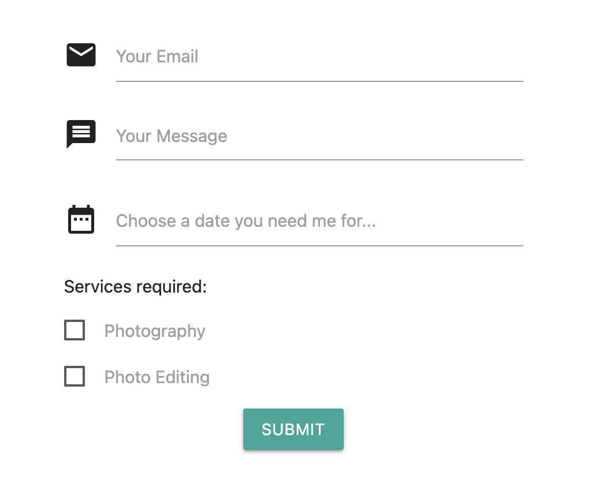

# Photo Service Website

## _Responsive Static Webpage Using Materialize CSS Front-End Framework_

---

[Click Here →] (https://germain712.github.io/Photo_Service_Website/ "Link to Webpage")

---

- If you hover over the social media icons in the header's navigation bar at the top right of the webpage you should see the labels pop up.

- You can click on the `Portraits`, `Cityscapes` & `Nature` images, and they will pop out to a larger size.

- When you scroll up, you will see the parallax pictures move up, and vice verse when you scroll down.

- In the contact section, if you click where is says `Choose a date you need me forr...`, the date picker will appear so you can select a date. You can click on all the other selectors in this section and see that it is active.

